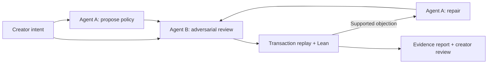

# auto-prove

This test branch adds the isolated [Uniswap v4 submission workflow](experiments/uniswap-v4/README.md). Its root `benchmark.json` is for the v4 development benchmark only; the escrow benchmark remains on `general-intent-pipeline`.

The v4 directory also contains a [falsification and repair loop](experiments/uniswap-v4/README.md#local-falsification-and-repair-loop): it starts with a base specification and contract, executes a counterexample in a local EVM, routes a proposed fix to the specification or contract after semantic judgment, and replays the repair. The hosted Yukon submission format accepts a bounded transaction trace as input and runs the full loop using a host-owned model account.

A reproducible escrow autoformalization experiment: one agent proposes a smart-contract specification, another challenges its interpretation of the creator's intent, and replay plus Lean check the evidence before a repair.

**Start with [the experiment report](REPORT.md).** Give [AGENTS.md](AGENTS.md) to your coding agent to set up and test the repository. Source code, recorded agent responses, interactive reports and proof-checking evidence are included.

## How it works



The synthetic challenge asks Alice to fund 100 token units for Bob until timestamp 10. Anyone may trigger release at or after the deadline, but only Bob receives the committed amount, once. Failed transfers preserve retry eligibility; donations do not enlarge entitlement.

Agent A supplies a closed policy plus requirement mappings, assumptions and unresolved questions. Agent B independently compares it with the original intent and submits concrete transaction traces. The engine compares the candidate with a hand-authored reference interpretation. The trusted compiler translates validated policy choices into Lean, never model-supplied source code. Supported objections can trigger repair; unsupported criticism stops for adjudication. Agent agreement leaves creator approval pending.

This pilot is a small escrow policy language, not unrestricted English-to-Lean translation. Read [REPORT.md](REPORT.md) for the precise proof scope and limitations.

## Quick start: inspect and replay without model access

```sh
git clone https://github.com/antojoseph/auto-prove.git
cd auto-prove
python3 app.py demo --skip-lean --output runs/reproduced-preview
```

Requires Python 3.9+ and no Python packages. Open `runs/reproduced-preview/report.html` in your browser. This mode runs semantic replay and clearly labels Lean as **not run**. You can also open the checked-in reports without running any code:

- `runs/demo/report.html`: faithful proposal and eight deliberately flawed variants.
- `runs/validated-live-loop/report.html`: actual fresh review, repair and independent re-review.

GitHub displays HTML source; clone or download the files to use them interactively. Every report is self-contained.

## Full verification

Install Python 3.9+, [elan / Lean](https://github.com/leanprover/elan) and [Foundry](https://github.com/foundry-rs/foundry#installation). This repository pins Lean **4.22.0** through `lean-toolchain`; Foundry pins Solidity **0.8.28** in `contracts/foundry.toml`.

If elan is already installed:

```sh
elan toolchain install leanprover/lean4:v4.22.0
lean --version
forge --version
bash scripts/reproduce.sh
```

For a machine without elan, its official installer can be saved and run:

```sh
curl --fail --location https://raw.githubusercontent.com/leanprover/elan/master/elan-init.sh --output /tmp/auto-prove-elan-init.sh
sh /tmp/auto-prove-elan-init.sh -y --no-modify-path --default-toolchain none
export PATH="$HOME/.elan/bin:$PATH"
elan toolchain install leanprover/lean4:v4.22.0
```

For Foundry, follow the official installation link above, then ensure `forge` is on PATH. The script runs Python tests, rechecks all nine recorded cases and both recorded live-loop rounds with Lean, and runs the Solidity suite. Foundry can download the pinned Solidity compiler on first use. No RPC endpoint, private key, model login or contract deployment is needed.

For existing executables or offline compilers, set `ESCROW_LEAN`, `ESCROW_FORGE`, `ESCROW_SOLC`, or `ESCROW_PYTHON` to their paths before running the script. An existing ESCROW_SOLC enables offline Forge compilation. Generated results go under ignored `runs/reproduced-*` directories, preserving the original evidence.

Expected results:

- **20 Python tests pass.** Transport and repair unit tests use mocked responses.
- **19 Solidity tests pass**, including 256 fuzz runs and eight generated counterexample replays.
- **Nine seeded candidate cases and both recorded live-loop rounds pass Lean checks.** Eight deliberately flawed candidates have supported objections, with none unsupported.
- The repaired live candidate has no demonstrated mismatch and Lean checks its abstract reference equivalence. Human approval remains pending and `accepted` remains false.

[GitHub Actions](.github/workflows/reproduce.yml) runs the same model-free verification on Ubuntu and uploads regenerated reports. Fresh model inference is not part of CI.

## Optional: run fresh agents with your own account

Install and authenticate your own [Codex CLI](https://developers.openai.com/codex/noninteractive/). The original integration test used CLI **0.157.0**; older clients may lack the required ephemeral-context or connector-disable flags. No account credentials are included. Choose a model available to your account; the original live test used `gpt-6-sol`, but readers' available models can differ.

```sh
# Propose a new candidate from the synthetic intent, then review it.
python3 app.py agents --rounds 2

# Begin with the repeated-payment flaw and exercise review, repair, re-review.
python3 app.py agents --candidate runs/demo/case-07/candidate.json --rounds 2

# Optional explicit model for this run; no account settings are changed.
python3 app.py agents --candidate runs/demo/case-07/candidate.json --model YOUR_AVAILABLE_MODEL --rounds 2
```

These commands make model calls through your account and send the supplied escrow intent and candidate to that provider. Default behavior inherits your configured model. Each invocation creates a new output directory. The runner disables shell actions, apps, plugins and configured MCP connectors, and uses separate ephemeral contexts. This is context separation, not a hard filesystem confidentiality boundary. It performs at most three review rounds and never grants creator approval automatically.

A fresh run may generate different candidate prose or objections. To reproduce the recorded result exactly, replay its saved responses instead of requesting new inference.

## Evaluate your own structured submission

```sh
python3 app.py evaluate candidate.json review.json --output runs/reproduced-my-review
```

Use the formats in `schemas/`. Creator intent is in `intent/creator.json`. Changing an amount, deadline or contract family also requires reviewing the reference interpretation, schema, traces and tests; the supplied scenario is intentionally fixed.

## Repository map

| Path | Purpose |
| --- | --- |
| `REPORT.md`, `AGENTS.md` | Experiment findings and agent reproduction guide |
| `intent/creator.json` | Synthetic requirements R1–R7 and environment assumptions |
| `schemas/`, `prompts/` | Structured submissions and independent role instructions |
| `engine.py` | Closed policy semantics, reference replay and bounded search |
| `lean/Escrow.lean`, `lean_compiler.py` | Trusted model, target generation and kernel checking |
| `contracts/` | Executable escrow reference and Solidity tests |
| `app.py` | Recorded demo, imported reviews and optional fresh-agent orchestration |
| `runs/demo/` | Seeded experiment reports, JSON evidence and Lean logs |
| `runs/validated-live-loop/` | Actual review, repair, re-review, usage records and Lean evidence |
| `runs/validation.json` | Consolidated original validation status |
| `scripts/reproduce.sh` | Model-free reproduction command |

## What the verifier establishes

Lean proves facts about an abstract transition model and the repaired release rule's equivalence to a hand-authored reference. It does not certify arbitrary English interpretation or Solidity/EVM correspondence. The Solidity tests supply executable evidence for selected scenarios. Creator review is separate from proof success, and no contract has been deployed.

The token model assumes exact-transfer, non-rebasing ERC20 behavior and atomic rollback. Lean abstracts callbacks, gas and compiler behavior; Solidity tests separately exercise a reentrant callback. Surplus donations remain locked in v1. This is a research prototype.

Reusable pieces are role prompts, submission validation, replay adjudication, proof generation, bounded repair orchestration and the evidence report. A new contract family needs a new semantic model and schema.

Technical context: [Solidity security considerations](https://docs.soliditylang.org/en/latest/security-considerations.html), [Ethereum formal verification](https://ethereum.org/developers/docs/smart-contracts/formal-verification/), and [Lean toolchain management](https://github.com/leanprover/elan).
